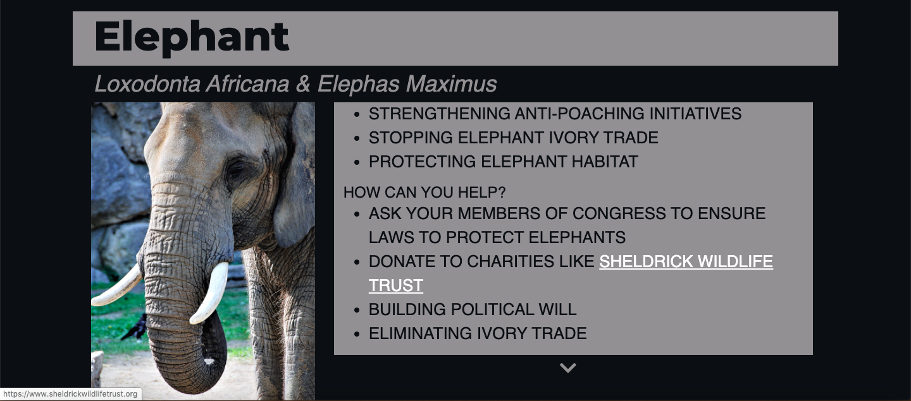
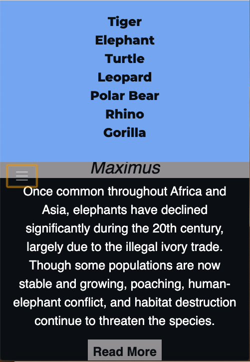

<h1>One World</h1>
<h3>First Milestone Project: User-Centric Frontend Development - Code Institute</h3>
<h4>By Lewis Hamilton</h4>

This is a website that introduces you to seven critical species covering useful infomation on each, including a small biography of each species, the causes of their demise, what the organisation is doing to help and what the user can do to help also.

 
<h3>Demo</h3>

A live demo can be found here <a href="https://lewejuice.github.io/oneworld/" rel="nofollow" target="_blank">here</a>.

 
<h3>UX</h3>

<h4>User Stories</h4>

As a user that would like to donate money to a certain animals cause, I need to be able to eaily find that species and it's donation page.

 

As a user that wants to find out some infomation about a species but only has a mobile phone to research it, I need to be able to navigate the site easily to locate my animal and read through detailed infomation all on a small screen.

 
<h4>Strategy</h4>

My design goal was to make it as easy as possible to navigate the website and also read detailed imfomation but in an uncluttered space.

 
<h4>Scope</h4>

For my users, I wanted to give them the passion, knowledge and motivation to help endangered species accross the world. This way they could obtain crutial infomation and feel they can make a difference.

 
<h4>Structure</h4>

I have used a suquential structure in my site to help the user navigate the site in a clear and simple way and help them access the imfomation they're looking for. I achieved this by creating a simple navbar and holding all infomation on one single page that they can either scroll through or jump straight to one part that they desire.

 
<h4>Skeleton</h4>

<a href="https://github.com/lewejuice/oneworld/blob/master/navbar.md">Navbar wireframe</a>

<a href="https://github.com/lewejuice/oneworld/blob/master/title.md">Title wireframe</a>

<a href="https://github.com/lewejuice/oneworld/blob/master/intro.md">Introduction wireframe</a>

<a href="https://github.com/lewejuice/oneworld/blob/master/animal.md">Animal wireframe</a>

<a href="https://github.com/lewejuice/oneworld/blob/master/social.md">Social wireframe</a>

 
<h4>Surface</h4>

I chose a colour scheme to match the colour of the animals to help the user to be able to scroll through and locate an animal by the colour of the section. I used a dark grey background to help all the colours stand out.

 
<h3>Technologies</h3>

<ol>
<li>HTML</li>
<li>CSS</li>
<li>JAVA SCRIPT</li>
<li>JQUERY</li>
<li>BOOTSTRAP</li>
<li>ADOBE CREATIVE SOFTWARE</li>
</ol>
 
<h3>Features</h3>

I have used animal icons in my navbar that grow larger and change colour when you hover over them using CSS. When the screen size shrinks I have the navbar collapses into a burger icon with a dropdown list of the animal names to make it more visable and clean on a smaller screen. The pargraphs are in scrolling text boxes on larger screens and have 'read more' buttons on smaller screens to neatly fit in large pargraphs of text. I have also added a 'back to top' button at the bottom of the page to help the user get back to top with ease, which also has inverted effect when hovered over. I have achived these fatures using CSS, Bootstrap, Java Script and jQuery.

<h4>Features Left to Implement</h4>

In the future I would like to add more content to the animal paragraphs and also a cleaner scrolling effect.

 
<h3>Testing</h3>

The user stories successfully achieved the intended outcome by firstly drawing them in with an inspirational 
logo and slogan, then followed by an eye capturing hero image. Secondly providing them a clear easy to use navbar to find the infomation they desire. All links provided will open in a new tab using 'target="_blank"' so the user wont loose the orignal site.
 
 

Here our my methods of testing.

<table>
<thead>
<tr>
<th>Devices</th>
<th>Browsers</th>
<th>Issues</th>
<th>Fixed</th>
</tr>
</thead>
<tbody>
<tr>
<td>iMac</td>
<td>Chrome</td>
<td>Was too spread out over a large screen</td>
<td>Used padding on the body for larger screens only</td>
</tr>
<tr>
<td>iPad</td>
<td>Mozzilla</td>
<td>See through navbar background confused user</td>
<td>Changed to solid colour matching the body</td>
</tr>
<tr>
<td>Macbook</td>
<td>Safari</td>
<td>Icons blur when hovered over</td>
<td>No</td>
</tr>
<tr>
<td>Lenovo Tablet</td>
<td>Explorer</td>
<td>None</td>
<td>N/A</td>
</tr>
<tr>
<td>iPhone 11 Pro</td>
<td>Safari</td>
<td>Back to top button blocking content</td>
<td>Instead of being fixed, it now stays in place</td>
</tr>
<tr>
<td>Samsung Galaxy</td>
<td>Samsung Internet browser</td>
<td>None</td>
<td>N/A</td>
</tr>
</tbody>
</table>
 
<h3>Deployment</h3>

This site is hosted by GitHub pages, and has been deployed directly from the master branch. The site will update automatically when new commits have been made to the master branch. So the site deploys correctly on GitHub pages, the landing page must be named index.html.

List of steps to run locally

Step 1: Paste git clone https://github.com/lewejuice/oneworld.git into your terminal.

Step 2 : Open index.html into browser of your choice

To cut ties with this GitHub repository, type git remote rm origin into the terminal.

 
<h3>Credits</h3>

<h4>Content</h4>

Magority of the written content I obtained from <a href="https://www.worldwildlife.org/">WWF</a>, which I altered to suit my needs. I did this because I knew WWF would provide accurate infomation about the animals and the help that is needed.

 
<h4>Media</h4>

My animal icons were obtained from <a href="#">here.</a> The logo design and hero image I designed my self on adobe illustrator. The images used were all from Google Images with the usage rights tool set too 'labelled for reuse'.

 
<h4>Acknowledgements</h4>

The read more text boxes on each section are modeled after the following Stack Overflow <a href="https://stackoverflow.com/questions/53955285/how-to-make-multiple-read-more-buttons-in-same-page-using-one-jquery/53955444" rel="nofollow">example</a>.

The scrolling text boxes on larger screens I obtained the model from this <a href="https://www.nosegraze.com/scrolling-text-box/" rel="nofollow">tutorial</a>.

The 'back to top' button code was obtained from this <a href="https://www.w3schools.com/howto/howto_js_scroll_to_top.asp" rel="nofollow">example</a>.

<strong>This is for educational use</strong>

